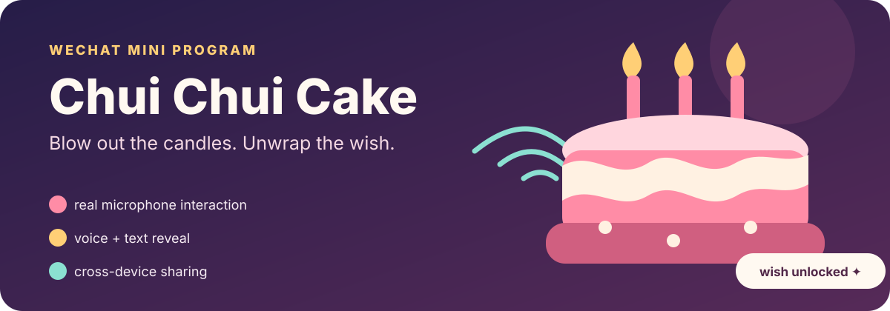

<p align="center">
  
</p>

<p align="center"><a href="./README.md">English</a> · <strong>中文</strong></p>

> 朋友生日当天你不在身边？送 TA 一块可以对着手机吹灭蜡烛的蛋糕——最后一簇火焰熄灭，祝福才出现。

这个仓库没有一行就能跑的快捷命令：CloudBase 需要真实 AppID 和手动开通的环境，麦克风也只在真机上有效。五步配置见下方。

吹吹蛋糕是一个用于异地生日祝福的微信小程序。挑一个蛋糕、插上蜡烛、写下或录下一段祝福，然后分享出去。对方对着手机麦克风吹气，每检测到一次有效吹气就熄灭若干蜡烛，直到最后一簇火焰消失，祝福才揭晓。

## 那个瞬间

```text
挑蛋糕 → 写祝福 → 分享链接 → 吹灭蜡烛 → 揭晓祝福
```

- 六款纯 CSS 绘制的蛋糕主题、五种蜡烛颜色——不需要任何图片素材
- 1–99 根蜡烛，超过 20 根时采用紧凑排布
- 可选的语音祝福，最长 30 秒
- 通过 CloudBase 的 `cakeId` 实现真正的跨设备分享
- 文字与语音揭晓，另有本地渲染的纪念卡片
- 麦克风权限不可用时，降级为长按

## 吹气检测怎么做的

[`blow-detector.js`](./吹吹蛋糕-小程序/utils/blow-detector.js) 用 `wx.getRecorderManager()` 录制 8 kHz、16 位、单声道的 PCM 帧。对每一帧计算归一化的 RMS 能量：

```text
rms = sqrt(sum(sample²) / sample_count)
```

连续三帧超过默认阈值 `0.08` 才判定为一次吹气。250 ms 的冷却时间避免一口气被重复计数。每次有效事件熄灭一到三根剩余蜡烛，并触发轻微震动反馈。

```javascript
new BlowDetector({
  rmsThreshold: 0.05,
  sustainFrames: 2,
  cooldownMs: 200
});
```

> 麦克风行为必须在真机上测试。微信开发者工具无法提供真实的麦克风帧，因此它走的是长按降级路径。

## 跑起小程序

1. 安装微信开发者工具，导入 [`吹吹蛋糕-小程序/`](./吹吹蛋糕-小程序/)。
2. 使用真实的小程序 AppID；CloudBase 不支持测试号。
3. 创建 CloudBase 环境，并替换 `app.js` 里的 `YOUR_ENV_ID`。
4. 创建 `cakes` 集合，对接收者可读，但只能通过带身份判断的后端流程写入。可选地创建 `events` 集合用于统计。
5. 部署 `cloudfunctions/` 下全部七个目录，并在云端安装依赖。
6. 在手机上预览，创建一个蛋糕，分享出去，然后把蜡烛吹灭。

详细配置与排查指南见[小程序 README](./吹吹蛋糕-小程序/README.md)。

## 架构

| 层 | 做什么 |
| --- | --- |
| 原生 WXML / WXSS / JS | 搭建创建、蛋糕、揭晓、历史和分享流程 |
| PCM + RMS 检测器 | 把持续的麦克风能量转成离散的吹气事件 |
| 七个云函数 | 创建、读取、列表、删除、埋点、记录完成、解析身份 |
| 云数据库与云存储 | 持久化蛋糕元数据和可选的语音录音 |
| 离屏 Canvas | 生成 750 × 1334 的纪念图片供保存到相册 |

## 当前边界

1.1 版是一个可跑的产品原型，但还不适合不受限制的公开发布。内容安全检查、过期自动清理、照片上传界面、订阅通知和接收者回礼仍在路线图上。数据库里记了过期时间戳，但目前没有定时任务真正执行删除。

## 许可

MIT，见 [LICENSE](./LICENSE)。
